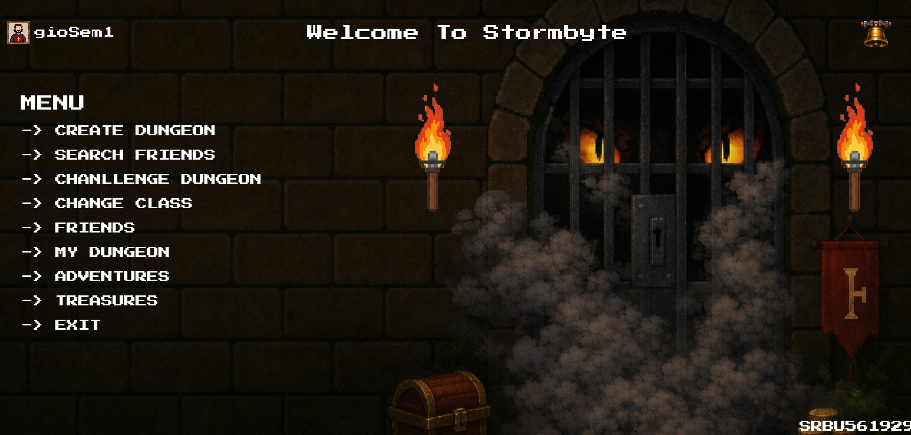

# 🏰 Stormbyte: The Cloud-Forge of Infinite Dungeons

*The gateway to Stormbyte: where retro aesthetics meet modern cloud power.*

## 📜 Vision & Core Concept
**Stormbyte** is a high-performance RPG ecosystem designed to bridge the gap between classic 16-bit dungeon crawlers and modern distributed architectures. While the aesthetic pays homage to the golden age of D&D and SNES-era pixel art, the underlying infrastructure is built to solve modern gaming challenges: **real-time state synchronization, global persistence, and AI-driven procedural storytelling.**

### Why Cloud?
The core mission was to move beyond the limitations of "stand-alone" software. By leveraging **Microsoft Azure**, Stormbyte provides an interconnected world where fantasy enthusiasts can:
* **Collaborate as Dungeon Masters:** Build complex, lethal maps that persist globally.
* **Explore as a Community:** Engage in group raids and share adventures in real-time.
* **Dynamic Evolution:** Experience a game world that grows through user-generated content and AI-narrated lore.

---

## 🏗️ Technical Architecture & Azure Integration
Stormbyte follows a **Cloud-Native** approach, utilizing managed services to ensure high availability, security, and effortless scaling.

### ☁️ Azure Service Stack

| Service | Category | Implementation & Purpose |
| :--- | :--- | :--- |
| **🌐 Azure App Service** | **Hosting** | Orchestrates the interactive frontend, managing user sessions and providing smooth navigation between game modules. |
| **⚡ Azure Functions** | **Compute** | The serverless "Brain". It handles procedural generation of dungeons, enemies, and traps, as well as combat logic and damage calculations. |
| **🌌 Azure Cosmos DB** | **Database** | Utilizing the **MongoDB API** to store user profiles, complex JSON dungeon schemas, and match history with sub-millisecond latency. |
| **🔔 Azure SignalR** | **Real-time** | Powers the multiplayer hub. It manages live chat, push notifications, and instant map synchronization across all connected clients. |
| **📦 Azure Blob Storage** | **Storage** | A scalable repository for graphic assets (sprites, tilesets), and generated map files. |
| **🧠 Azure AI** | **Intelligence** | Enhances narrative depth by dynamically generating unique dungeon lore and character backstories for a personalized experience. |

---

## 🎮 Gameplay Features & Interface
The dashboard (as seen in the screenshots) reflects a deep focus on atmosphere and immersion.

*The Fog of War and Dynamic Lighting systems are rendered via Phaser.js, utilizing hardware acceleration for a smooth experience.*

*The Editor allows for real-time creation, instantly syncing every wall and trap to the Azure Cloud.*

---

## 🛠️ Technology Stack
* **Game Engine:** [Phaser.js](https://phaser.io/) (WebGL/Canvas)
* **Languages:** TypeScript (Strictly typed logic), Pure HTML5, CSS3.
* **Backend:** Azure Serverless Functions.
* **Database:** MongoDB via Azure Cosmos DB.
* **Real-time:** WebSockets powered by Azure SignalR.
* **Intelligence:** Azure OpenAI Service for procedural storytelling.

---

### 🧙 Developed by: **gioSem1**